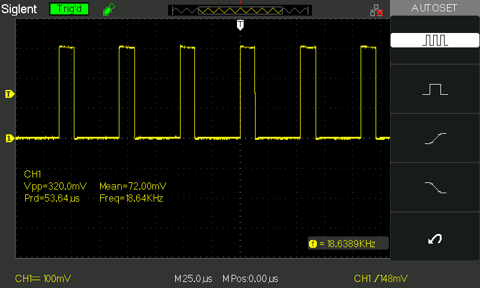
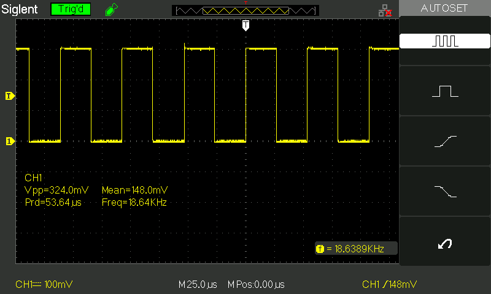
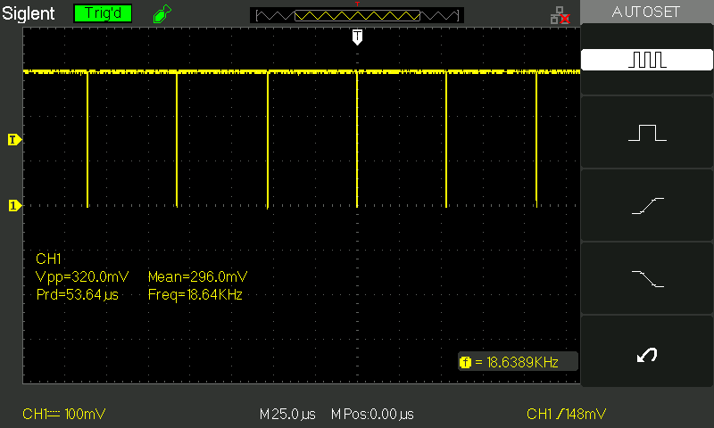

# Vaja 7 - krmiljenje PWM signala

## Cilj naloge

S pomočjo programskega okolja STM32CubeIDE in HAL knjižnicami sprogramirajte mikroprocesor tako, da boste generirali PWM signal in ga tudi krmilili na izbranem izhodu STM32F4 Discovery. Za preizkus potrebujete osciloskop.

## Postopek inicializacije periferije

- pini za vhode sje **PE9**.  
- Poleg pina se izpiše **TIM1_CH1**.  
- Vrednost Prescalerja je **16**.  
- sedaj znaša **100kHz**
- Ta parameter spreminja moč signala.
- *sConfigOC.Pulse = x;*
- *sConfigOC.Pulse = 25;*
- Ukazi
  1. Poslje signal na pin
  2. Poveca dutycycle za 10
  3. Previri ce je dutyCycle nad 90 in ga spremeni na 10 ce je

## Slika osiloskopa 25%

## Slika osiloskopa 50%

## Slika osiloskopa 100%

## Komentar
Koda deluje brezhibno.
